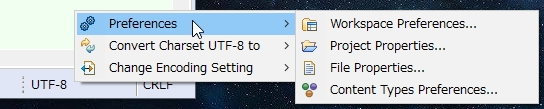

# Encoding StatusBar Eclipse Plugin
Show file information for the active editor in the Eclipse status bar.  

**Show file encoding and line ending**  
Line ending support showing CRLF, CR, LF and Mixed, can also be converted.  
  

**Change "Text File Encoding" setting by file property**  
To add the encoding, use Preference > General > Workspace > Text File Encoding > Other.  
  
Autodetect: Automatic detection by juniversalchardet  
Inheritance: Inherited from folder or project properties, workspace preferences  
Content Type: Determined from content type setting  

**Encoding Preferences Shortcuts**  
  

## Installation
Drag-n-drop the following button to your running Eclipse main toolbar to install Encoding StatusBar plugin.  

<!--
**Eclipse Marketplace**  
https://marketplace.eclipse.org/content/encoding-statusbar  
Drag install button of the above site to your running Eclipse workspace to install.  

**Update Site**  
Help > Install New Software...  
https://raw.githubusercontent.com/cypher256/eclipse-encoding-plugin/master/eclipse.encoding.plugin.update/site.xml
-->

## License
[Eclipse Public License - v 1.0](https://www.eclipse.org/legal/epl-v10.html)  
Copyright (c) 2016- Shinji Kashihara and others. All rights reserved.  
Original source: [ystsoi/eclipse-fileencodinginfo](https://github.com/ystsoi/eclipse-fileencodinginfo)
